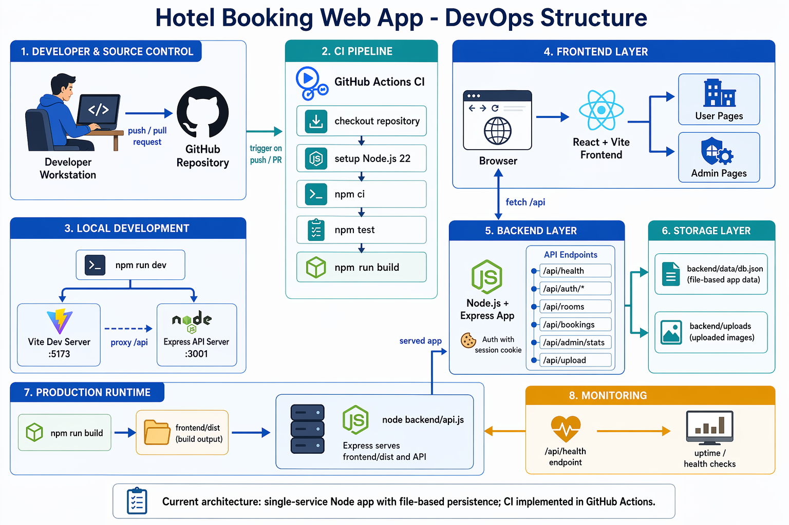

# H Hotel Booking Web Application

This project is a full-stack hotel booking web app built for a Software Deployment and Evolution assignment. It includes a React frontend, an Express backend, local data storage, and a basic CI setup using GitHub Actions.

The system lets users browse rooms, sign up, log in, make bookings, and view their booking history. It also includes admin pages for room management, booking management, and dashboard statistics.

## Project Overview

The app is split into two main parts:

- `frontend/` contains the React app built with Vite and TypeScript
- `backend/` contains the Express API and local JSON data storage

During development, the frontend runs on Vite and sends API requests to the backend through a proxy. In production mode, the backend can serve the built frontend from `frontend/dist`.

## Main Features

- User signup and login
- Session-based authentication with cookies
- Browse hotel rooms
- View room details
- Create bookings
- View booking history
- Admin dashboard
- Admin room management
- Admin booking management
- Room image upload
- Health check endpoint at `/api/health`

## Technology Used

### Frontend

- React
- Vite
- TypeScript
- React Router

### Backend

- Node.js
- Express
- CORS
- Multer

### Testing and CI

- Jest
- Supertest
- GitHub Actions

### Current Data Storage

- Local JSON file: `backend/data/db.json`

## DevOps Structure

The current DevOps flow for this project is simple:

1. Code is stored in GitHub.
2. GitHub Actions runs when code is pushed or when a pull request is created.
3. The workflow installs dependencies, runs tests, and builds the app.
4. The frontend can be built into `frontend/dist`.
5. The backend serves the API and can also serve the built frontend.

### Current CI Workflow

The workflow file is located at `.github/workflows/ci.yml`.

It currently does these steps:

- check out the repository
- set up Node.js 22
- run `npm ci`
- run `npm test`
- run `npm run build`

## Current Architecture

### Local Development

- Frontend dev server: `http://localhost:5173`
- Backend API server: `http://localhost:3001`
- Vite proxies `/api` requests to the backend

### Production Style Run

- `npm run build` builds the frontend into `frontend/dist`
- `npm start` runs `backend/api.js`
- Express serves API routes and the frontend build

### Data and Uploads

- App data is stored in `backend/data/db.json`
- Uploaded room images are stored in `backend/uploads`

## What Has Been Done

These parts are already working in the repository:

- Frontend pages for users and admin
- Backend API using Express
- User login and registration
- Room listing and room details
- Booking creation and booking management
- Admin dashboard and stats endpoint
- Image upload support
- Local JSON-based persistence
- Health check endpoint
- Automated backend tests
- GitHub Actions CI for test and build
- Production build support

## What Has Not Been Done Yet

These parts are still planned or not implemented yet:

- Deployment to Render
- Fallback deployment to Railway or Fly.io
- Docker container setup
- Docker Hub image publishing
- Supabase Postgres integration
- Supabase Auth integration
- UptimeRobot monitoring
- Full automatic CD deployment after CI passes

***In short, the app works locally and the CI pipeline is already set up, but the cloud deployment and monitoring parts are still missing.***

## What To Do Next

Ongoing steps are:

1. Deploy the app to Render or another hosting platform.
2. Move the data from `db.json` to PostgreSQL or Supabase.
3. Add Docker so deployment is more consistent.
4. Add monitoring using UptimeRobot.
5. Add a real CD pipeline for automatic deployment.
6. Store all deployment secrets in GitHub Secrets and the hosting platform settings.

## Project Structure

```text
hotel_web_app/
|-- backend/
|   |-- api.js
|   |-- auth.js
|   |-- api.test.mjs
|   |-- data/
|   |   `-- db.json
|   `-- uploads/
|-- frontend/
|   |-- app/
|   |   |-- components/
|   |   |-- pages/
|   |   |-- api.ts
|   |   |-- App.tsx
|   |   |-- main.tsx
|   |   |-- router.tsx
|   |   `-- types.ts
|   |-- styles/
|   |   `-- index.css
|   |-- index.html
|   `-- vite.config.ts
|-- .github/
|   `-- workflows/
|       `-- ci.yml
|-- package.json
`-- README.md
```

## How To Run The Project

### Install dependencies

```powershell
npm install
```

### Run in development

```powershell
npm run dev
```

### Run tests

```powershell
npm test
```

### Build the frontend

```powershell
npm run build
```

### Start the app

```powershell
npm start
```

## Useful URLs

- Frontend: `http://localhost:5173`
- Backend: `http://localhost:3001`
- Health check: `http://localhost:3001/api/health`

## Simple Summary

This project already works as a local full-stack hotel booking system with testing and CI build automation. The main things still not finished are cloud deployment, Docker, external database setup, and monitoring.


